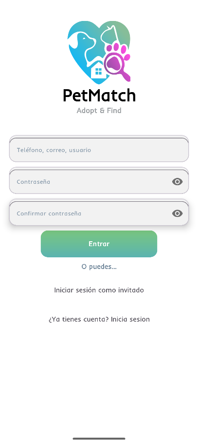
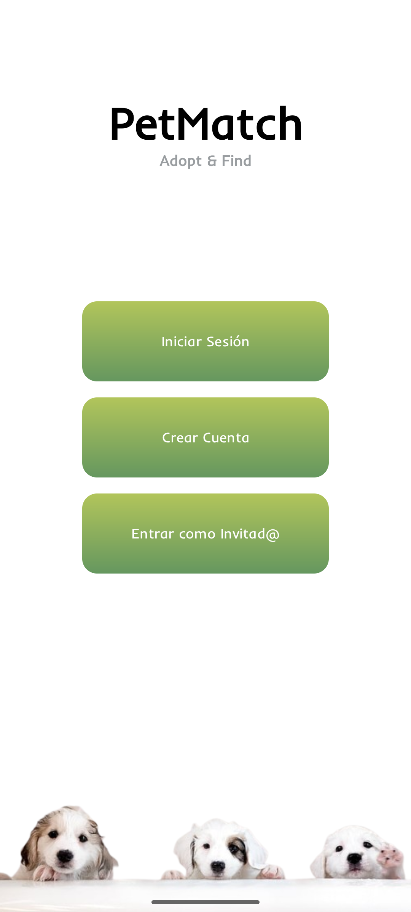
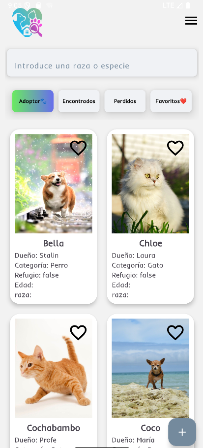
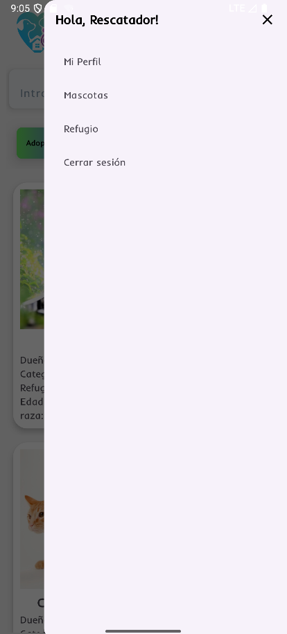

# 📱 PetMatch

PetMatch es una aplicación Android diseñada para facilitar la conexión entre refugios, casas de acogida y particulares con personas interesadas en adoptar mascotas o localizar animales perdidos.

La aplicación centraliza en una sola plataforma los procesos de adopción, animales encontrados, mascotas perdidas y gestión de favoritos, ofreciendo una experiencia clara y estructurada. La autenticación y gestión de datos se realiza mediante un backend en Django, por lo que la aplicación consume una API REST para la validación de usuarios y la obtención/publicación de animales.

Este proyecto demuestra integración real con backend, consumo de APIs REST, gestión de sesiones, carga de imágenes y manejo estructurado de datos en un entorno Android moderno.

## 🚀 Características

🔐 Registro e inicio de sesión validados mediante backend Django

👤 Acceso como invitado (con funcionalidades limitadas)

🐶 Listado de animales organizados por pestañas:

Adoptar

Encontrados

Perdidos

Favoritos

➕ Publicación de nuevos animales con imagen desde cada pestaña

⭐ Sistema de favoritos

📋 Gestión de mascotas propias (registro y seguimiento)

🏠 Listado de refugios colaboradores

📡 Conexión en tiempo real con servidor Django

🧭 Navegación con menú hamburguesa persistente

🖼️ Carga eficiente de imágenes desde servidor

🛠️ Tecnologías y herramientas
📌 Lenguaje

Java 11

## 🏗️ Arquitectura

Actualmente arquitectura basada en Activities y consumo directo de servicios REST.

## 📚 Jetpack Components

AppCompat

ConstraintLayout

RecyclerView

CardView

Activity

Material Components

## 🌐 Networking

Retrofit 2

Gson Converter

OkHttp

Logging Interceptor

## 🖼️ Carga de imágenes

Glide

## 🔐 Seguridad

BCrypt (validación y encriptación)

##🛠️ Entorno de desarrollo

Android Studio

Gradle (KTS)

compileSdk 36

minSdk 24

targetSdk 36

## 🧠 Arquitectura

La aplicación sigue una estructura modular clásica basada en:

Activities como puntos principales de navegación.

RecyclerView + CardView para renderizado dinámico de listas.

Retrofit para la comunicación con la API REST de Django.

Modelos de datos (POJOs) para mapear respuestas JSON mediante Gson.

Menú hamburguesa persistente para navegación global.

ScrollView y Tabs para organización visual por categorías.

La aplicación depende de un servidor Django activo para:

Autenticación de usuarios

Validación de credenciales

Persistencia de animales

Gestión de favoritos

##📸 Screenshots

## ⚙️ Instalación ARREGLAR

Clona el repositorio:

git clone https://github.com/rodgar00/Pet-Match.git

Abre el proyecto en Android Studio.

Asegúrate de tener:

JDK 11

SDK mínimo API 24

Servidor Django corriendo

Sincroniza Gradle.

## ▶️ Ejecución

Inicia el servidor Django (necesario para autenticación y datos).

Ejecuta la app desde Android Studio.

Selecciona:

Emulador Android

Dispositivo físico con modo desarrollador activado

## 📂 Estructura del proyecto ARREGLAR
PetMatch/
│
├── app/
│   ├── src/
│   │   ├── main/
│   │   │   ├── java/com/rodgar00/petmatch/
│   │   │   │   ├── activities/
│   │   │   │   ├── adapters/
│   │   │   │   ├── models/
│   │   │   │   ├── network/
│   │   │   │   └── utils/
│   │   │   │
│   │   │   ├── res/
│   │   │   │   ├── drawable/
│   │   │   │   ├── layout/
│   │   │   │   ├── menu/
│   │   │   │   └── font/
│   │   │   │
│   │   │   └── AndroidManifest.xml
│   │
│   ├── test/
│   └── androidTest/
│
├── build.gradle.kts
├── settings.gradle.kts
└── gradle/

## 🔮 Mejoras futuras ARREGLAR

-Libro de mascota.
-Conectar perreras.
-Nueva sección de editar publicaciones de animales subidos por usuario.
-Perfil unico para cada usuario.
-Contacto de refugios (futuro formulario para conectar refugios).
-Subir animal para cada seccion(perdidos y encontrados).
-Arreglar perfil, un layout para perfil unico y para editarlo.

## 👨‍💻 Autor

Rodrigo García
Josué Manuel Zapata
Stalin Libardo
##📎 Proyecto desarrollado como aplicación académica con enfoque en integración real cliente-servidor.

